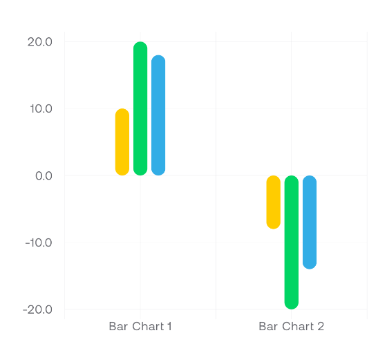
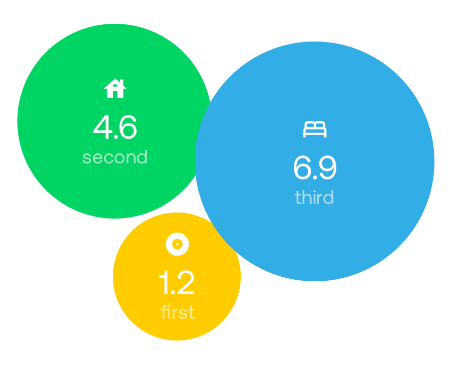
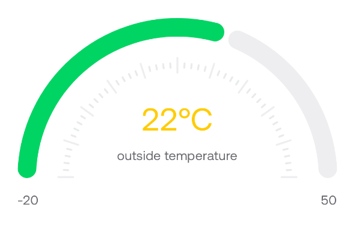
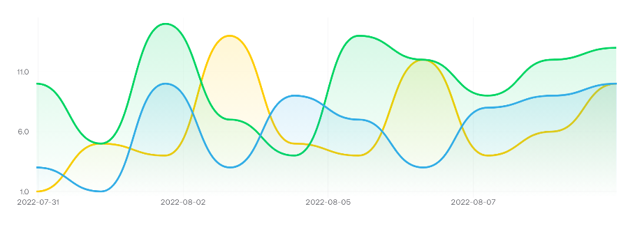
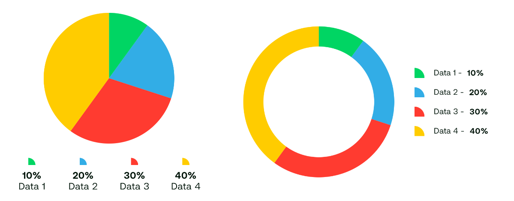

# Aught One Charts

[](https://central.sonatype.com/artifact/io.github.aughtone/charts)
[](LICENSE)


Chart composables for Compose Multiplatform projects. Targets Android, JVM/Desktop, iOS and the web (Kotlin/JS and Kotlin/Wasm).

It is called from Kotlin only. Every chart is a `@Composable`, which Swift and JavaScript cannot call, and the library publishes no Apple framework, Swift package, npm package or `@JsExport`ed API: its iOS, JavaScript and Wasm artifacts are klibs for Kotlin consumers.

> [!WARNING]
> **This library is alpha (`0.0.x`), and its API is still being worked out.** Composable signatures, config classes and the defaults objects may change between releases, and some changes will be breaking. Each one is listed in the [changelog](CHANGELOG.md).

## 🙏 Accreditation
This library was originally forked from the [compose-multiplatform-charts](https://github.com/netguru/compose-multiplatform-charts) project, created and maintained by the team at [Netguru](https://www.netguru.com). 

Since the original project appears to no longer be actively maintained and reaching out went unanswered, we have forked the library to continue its development, support newer Kotlin Multiplatform environments, add new chart components, and prepare it for publishing.

The original code is licensed under the MIT License and remains under it — see [LICENSE-MIT.md](LICENSE-MIT.md). This fork is licensed under the Apache License 2.0 — see [LICENSE](LICENSE) and [NOTICE.md](NOTICE.md).

## 📥 Installation
### Using local build
Go to the root directory and build the project, or run the local publish script:
```sh
./publish-local.sh
```
This builds the artifacts and publishes them to your local Maven repository (`~/.m2/repository`).

### Using maven dependency
Add the dependency to your Kotlin Multiplatform or Android project:

```kotlin
// commonMain sourceSet dependencies
implementation("io.github.aughtone:charts:0.0.3")
```

## 🚀 Usage
The library provides following components:
 - [BarChart](#barchart) — and `BarChartWithLegend`
 - [BubbleChart](#bubblechart)
 - [Dial](#dial) — and `PercentageDial`, a variant fixed to 0–100
 - [GasBottle](#gasbottle)
 - [LineChart](#linechart) — and `LineChartWithLegend`
 - [PieChart](#piechart) — and `PieChartWithLegend`
 - [Simple charts](#simple-charts) — `SimpleLineChart`, `SimpleBarChart` and `ArcProgressBar`

`ChartLegend` can also be used on its own to place a legend elsewhere in your own layout.

`BarChart`, `LineChart`, `Dial` and `GasBottle`, with their variants, read their colors from `LocalChartColors`, which has no usable default: provide a palette above them, as described under [theming](#-theming), or they draw blank. `PieChart` and `BubbleChart` take their colors from the data, and the simple charts from `MaterialTheme`.

Most of the components have arguments like:
 - **data** - depends on chart type it's complex dataset or few primitives arguments
 - **colors** - gives the possibility to change colors of the chart. In some cases the colors are stored in datasets (like in BarChart or LineChart). See [theming](#-theming) section to set same appearance to all charts.
 - **config** - allows to personalize charts. Depends on chart type it can modify different parts of component. See documentation of specific chart
 - **animation** - the way how chart should appear at the first time

### BarChart


Before using component the BarChartData has to be prepared:
```kotlin
val barChartData = BarChartData(
    categories = listOf(
        BarChartCategory(
            name = "Bar Chart 1",
            entries = listOf(
                BarChartEntry(
                    x = "primary",
                    y = 17f,
                    color = Color.Yellow,
                ),
                BarChartEntry(
                    x = "secondary",
                    y = 30f,
                    color = Color.Red,
                ),
            )
        ),
        BarChartCategory(
            name = "Bar Chart 2",
            entries = listOf(
                BarChartEntry(
                    x = "primary",
                    y = -5f,
                    color = Color.Yellow,
                ),
                BarChartEntry(
                    x = "secondary",
                    y = -24f,
                    color = Color.Red,
                ),
            )
        ),
    )
)
```

```kotlin
BarChart(
    data = barChartData,
    config = BarChartConfig(
        thickness = 14.dp,
        cornerRadius = 7.dp,
    ),
    modifier = Modifier.height(500.dp),
    animation = ChartAnimation.Sequenced(),
)
```

There is another component called `BarChartWithLegend`. It renders bar chart with legend.

The y-axis is rounded out to a multiple of `BarChartConfig.roundMinMaxClosestTo`, 10 by default: the minimum down, the maximum up. Data spanning less than one step sits in a thin band of the chart, so pass a smaller step for small or narrow values. `LineChart` takes the same parameter.

### BubbleChart


Before using component the list of Bubble has to be prepared:
```kotlin
val bubbles = listOf(
    Bubble(
        name = "first",
        value = 1.2f,
        icon = Icons.Default.Album,
        color = Color.Yellow
    ),
    Bubble(
        name = "second",
        value = 4.6f,
        icon = Icons.Default.House,
        color = Color.Green
    ),
    Bubble(
        name = "third",
        value = 6.9f,
        icon = Icons.Default.Bed,
        color = Color.Blue
    ),
)
```

```kotlin
BubbleChart(
    bubbles = bubbles,
    modifier = Modifier.size(300.dp),
    animation = ChartAnimation.Sequenced(),
)
```

### Dial


```kotlin
Dial(
    value = 22,
    minValue = -20,
    maxValue = 50,
    modifier = Modifier.fillMaxWidth(),
    animation = ChartAnimation.Simple {
        spring(
            dampingRatio = Spring.DampingRatioMediumBouncy,
            stiffness = Spring.StiffnessLow
        )
    },
    config = DialConfig(
        thickness = 20.dp,
        roundCorners = true,
    ),
    mainLabel = {
        Column(
            horizontalAlignment = Alignment.CenterHorizontally
        ) {
            Text(
                text = "$it°C",
                style = MaterialTheme.typography.headlineMedium,
                color = Color.Yellow
            )
            Text(
                text = "outside temperature",
                style = MaterialTheme.typography.bodyMedium,
                modifier = Modifier.padding(top = 12.dp)
            )
        }
    }
)
```

There is another component `PercentageDial`. It accepts only one data argument `percentage` in [0-100] range.

`Dial`, `PercentageDial`, `GasBottle` and `PieChart` show a single value, and throw `UnsupportedOperationException` if given `ChartAnimation.Sequenced`; use `ChartAnimation.Simple()` or `ChartAnimation.Disabled`.

### GasBottle


```kotlin
GasBottle(
    percentage = 75f,
    modifier = Modifier.size(width = 200.dp, height = 300.dp),
    animation = ChartAnimation.Simple {
        spring(
            dampingRatio = Spring.DampingRatioMediumBouncy,
            stiffness = Spring.StiffnessVeryLow
        )
    }
)
```

`percentage` runs from 0 to 100 and is clamped to it. A value from 1 to 5 is drawn as 5, so a nearly empty bottle stays visible.

### LineChart


Before using component the LineChartData has to be prepared. Each point's `x` is a timestamp in epoch milliseconds:
```kotlin
val start = 1_700_000_000_000L // any timestamp, in epoch milliseconds
val day = 1.days.inWholeMilliseconds

val lineData = remember {
    LineChartData(
        series = (1..3).map {
            LineChartSeries(
                dataName = "data $it",
                lineColor = listOf(
                    Color.Yellow,
                    Color.Red,
                    Color.Blue,
                )[it - 1],
                listOfPoints = (1..10).map { point ->
                    LineChartPoint(
                        x = start + point * day,
                        y = (1..15).random().toFloat(),
                    )
                }
            )
        },
    )
}
```

The chart draws no time labels unless you give it some: `xAxisLabel` and `overlayHeaderLabel` default to `GridDefaults.NoLabel`, because the chart cannot know how your reader wants time shown. Each is given a timestamp as a `Long` in epoch milliseconds. To show times, format it and wrap the stock label, which keeps its styling. This uses [aughtone-format](https://github.com/aughtone/aughtone-format), but any formatter works:
```kotlin
fun formatDate(epochMillis: Long): String =
    Instant.fromEpochMilliseconds(epochMillis)
        .format(dateStyle = DateTimeStyle.Short, timeStyle = DateTimeStyle.None)

LineChart(
    lineChartData = lineData,
    modifier = Modifier.height(300.dp),
    xAxisLabel = { GridDefaults.XAxisLabel(formatDate(it as Long)) },
    overlayHeaderLabel = { GridDefaults.OverlayHeaderLabel(formatDate(it as Long)) },
    animation = ChartAnimation.Sequenced()
)
```

Time ticks fall on round times counted from the epoch — whole hours, or multiples of a minute or second step for short windows — which is UTC. A formatter that shows local time will label them in the reader's zone.


### PieChart


Before using component the list of PieChartData has to be prepared:
```kotlin
val data = listOf(
    PieChartData(
        name = "Data 1",
        value = 10.0,
        color = Color.Yellow,
    ),
    PieChartData(
        name = "Data 2",
        value = 20.0,
        color = Color.Green,
    ),
    PieChartData(
        name = "Data 3",
        value = 30.0,
        color = Color.Blue,
    ),
    PieChartData(
        name = "Data 4",
        value = 40.0,
        color = Color.Red,
    )
)
```
```kotlin
PieChart(
    data = data,
    modifier = Modifier.size(300.dp),
    config = PieChartConfig(
        thickness = 40.dp
    ),
)
```

By default the thickness is `Dp.Infinity`, it means the chart will be fully filled.

### Simple charts

Lightweight charts that take a plain list of values and no configuration object. They draw no axes, grid or labels, which makes them suited to sparklines and inline indicators rather than full charts. Unlike the charts above they read their default colors from `MaterialTheme`, not from `LocalChartColors`.

```kotlin
SimpleLineChart(
    dataPoints = listOf(3f, 1f, 4f, 1f, 5f, 9f, 2f),
    modifier = Modifier.fillMaxWidth().height(64.dp),
    useCurvedLines = true,
)

SimpleBarChart(
    dataPoints = listOf(3f, 1f, 4f, 1f, 5f, 9f, 2f),
    modifier = Modifier.fillMaxWidth().height(64.dp),
)

ArcProgressBar(
    progress = 0.72f,
    modifier = Modifier.size(120.dp),
)
```

With `adaptToData = true` (the default) the line and bar charts scale to the range of the values given; set it to `false` when the values are already normalised to `0f..1f`. `ArcProgressBar` always takes `progress` in `0f..1f`, and its arc can be swept elsewhere with `startAngle` and `totalArcDegrees`.

## 🎨 Theming
Provide `ChartColors` in the app theme. This is required, not just convenient: `LocalChartColors` defaults to `Color.Unspecified` throughout, so a chart with no palette above it draws no grid and an invisible tooltip.
```kotlin
private val chartColors = ChartColors(
    primary = Color.Green,
    grid = Color.LightGray,
    surface = Color.White,
    fullGasBottle = Color.Green,
    emptyGasBottle = Color.Red,
    overlayLine = Color.Magenta
)

@Composable
fun AppTheme(
    darkTheme: Boolean = isSystemInDarkTheme(),
    content: @Composable () -> Unit,
) {
    CompositionLocalProvider(
        // ...
        LocalChartColors provides chartColors,
    ) {
        MaterialTheme(
            // ...
            content = content,
        )
    }
}

```
There is also default ChartColors provided by the library. It uses the default color set from `MaterialTheme`.
```kotlin
LocalChartColors provides ChartDefaults.chartColors()
```

Each chart has its own color set which can be used like:
```kotlin
BarChart(
    data = barChartData,
    colors = BarChartColors(grid = Color.LightGray, surface = Color.White)
)
```

Also there is possibility to use ChartColors inside the specific chart:
```kotlin
BarChart(
    data = barChartData,
    colors = ChartColors(...).barChartColors,
)
```

## 🤖 Agent skill

The sources jar carries a skill for coding agents, at `commonMain/skills/io-github-aughtone-charts/SKILL.md`, rather than hosting it anywhere. An agent that resolves `io.github.aughtone:charts` reads the guidance for exactly the version it resolved: what the library is for, the patterns that cover most callers, the traps that compile and are wrong, and what changed since the previous release. It follows the [Agent Skills specification](https://agentskills.io/specification), and its source is [`charts/src/commonMain/skills/io-github-aughtone-charts/SKILL.md`](charts/src/commonMain/skills/io-github-aughtone-charts/SKILL.md).

## 📄 License
Apache License 2.0 — see [LICENSE](LICENSE) and [NOTICE.md](NOTICE.md).

Most of the `charts` module is derived from [compose-multiplatform-charts](https://github.com/netguru/compose-multiplatform-charts), Copyright (c) 2022 Netguru, which is licensed under the MIT License and remains under it — see [LICENSE-MIT.md](LICENSE-MIT.md).
